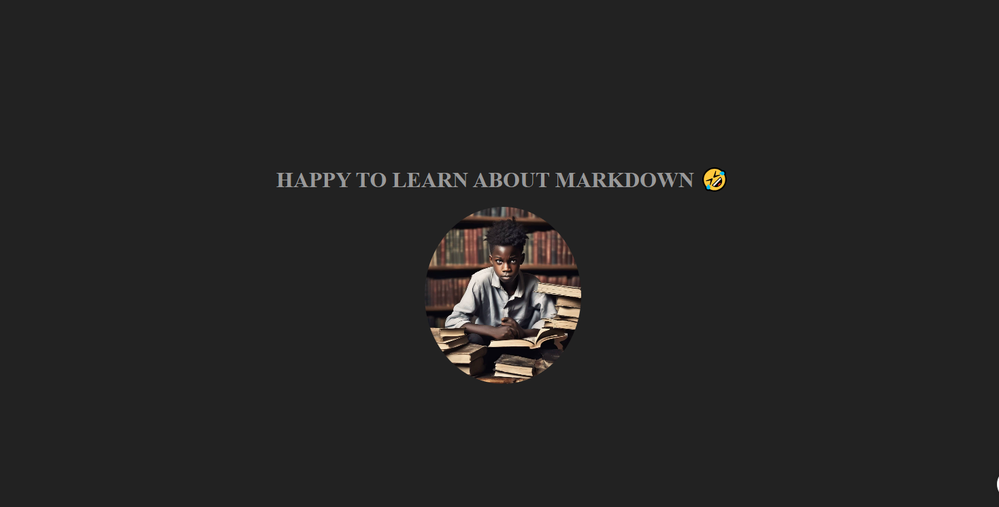

#
<!-- @import "[TOC]" {cmd="toc" depthFrom=1 depthTo=6 orderedList=false} -->
#   A SIMPLE WEBSITE ABOUT MY PROFILE👋
##  A simple website showcasing my profile as a developer🖥️


Lorem ipsum dolor sit, amet consectetur adipisicing elit. Ullam eius sequi laudantium animi molestias, est minima cum nam autem ratione dolor itaque eligendi cumque atque illum placeat, adipisci omnis earum, ducimus fugiat temporibus. Quidem sed eligendi officia quae rem. Quam placeat voluptate quae non provident!

## How to run this Project <mark>Locally</mark>😘

this  is a __bold__ text

<!-- now lets look at italics -->

This text is *italics*


This project is like  H<sub>2</sub>0 in Chemistry, you cannot do without it and growing like the function e <sup>x</sup> in mathematics


Please I want you to edit the footer but not the ~~navbar~~

```js
const x=4;
const y=3
console.log(x+y)


```


## PYTHON CODE NOW
```python
def calculate(x,y):
   return x+y

```

## Find Me 🌕

[Linkedin](https://linkedin.com)

[Linkedin](https://linkedin.com)


[Linkedin](https://linkedin.com)


## Project Screenshot 📷


